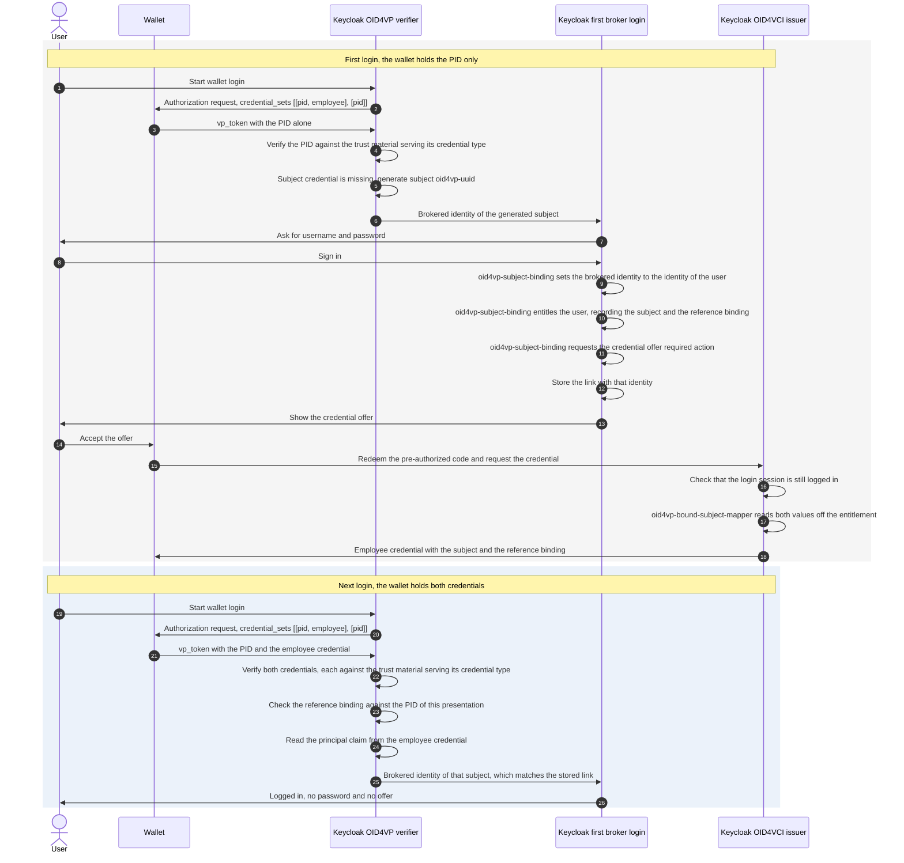

# Configuration

The extension is configured as a Keycloak identity provider. All settings are stored in the IdP provider config and can be managed through the Admin UI or realm import JSON.

## Adding the Identity Provider

1. Open the Keycloak Admin Console.
2. Go to **Identity Providers**.
3. Select **OID4VP**.
4. Configure the provider settings.

If you want transient wallet logins, Keycloak must be started with the `transient-users` feature enabled. Then enable the IdP's built-in **Do not store users** option in Keycloak.

Example realm import fragment:

```json
{
  "identityProviders": [
    {
      "alias": "oid4vp",
      "displayName": "Sign in with Wallet",
      "providerId": "oid4vp",
      "enabled": true,
      "config": {
        "clientIdScheme": "x509_san_dns",
        "responseMode": "direct_post.jwt",
        "x509CertificatePem": "-----BEGIN CERTIFICATE-----\n...\n-----END CERTIFICATE-----",
        "walletScheme": "openid4vp://"
      }
    }
  ]
}
```

## Settings

### Credential Request

The DCQL query is generated from the configured OID4VP mappers. The mapper type determines the credential format; its configuration contributes the credential type and claim path. The [IdP mappers](#idp-mappers) section describes how claim sets are formed. At least one mapper with a credential type is required.

| Key | Description | Default |
|-----|-------------|---------|
| `credentialSets` | DCQL `credential_sets` constraints in specification syntax, referencing credential ids. Empty requires every configured credential. | *(none)* |
| `requestObjectLifespanSeconds` | Lifespan of the signed request object JWT used by the wallet fetch. | `10` |

Each mapper contributes to the credential named by its `credential.id`. Mappers sharing an id form one credential entry, so the same credential type can be requested twice with different claims. An empty `credential.id` derives the id from format and credential type: `sdjwt_urn_eudi_pid_1`, `mdoc_org_iso_18013_5_1_mDL`. DCQL restricts ids to letters, digits, `_` and `-`.

`credentialSets` lists alternative credential combinations in preference order. To request a PID together with an mDL but accept the PID alone:

```json
[{"purpose": "Login", "options": [["sdjwt_urn_eudi_pid_1", "mdoc_org_iso_18013_5_1_mDL"], ["sdjwt_urn_eudi_pid_1"]]}]
```

`required` defaults to `true`; an entry with `"required": false` describes an optional extra credential. Without `credentialSets` the query carries no `credential_sets` member, which per DCQL requires every credential in the query.

The configuration is validated when the identity provider is saved, and again when the DCQL query is built, because identity provider mappers have no validation hook of their own. A presented credential set that satisfies no option of a required set rejects the login.

### User Mapping

| Key | Description | Default |
|-----|-------------|---------|
| `principalAttributes` | The claims that identify the user, as a comma separated list of `credentialId:claimPath` entries in the order they are tried. See [Which Claim Carries the Subject](#which-claim-carries-the-subject). Required unless OID4VP transient users are enabled. | *(none)* |
| `allowMissingSubjectCredential` | Accepts a presentation that does not carry the subject credential. Requires `principalAttributes`, because the setting says which credentials may be missing. See [Subject Credential Issued by This Keycloak](#subject-credential-issued-by-this-keycloak). | `false` |
| `doNotStoreUsers` | Native Keycloak IdP setting. When enabled, OID4VP switches to transient per-login identities, ignores configured identifying claims, and relies on Keycloak transient users. Requires the Keycloak `transient-users` feature to be enabled. | `false` |
| `clockSkewSeconds` | Allowed clock skew for ID token time checks. | `60` |

### Which Claim Carries the Subject

`principalAttributes` says which claim of which credential identifies the user. It is required, because nothing else does: which claim carries the subject belongs to the credential rather than to the identity provider, so a single verifier-wide claim name cannot serve a query of several credentials.

```properties
principalAttributes = sdjwt_urn_eudi_pid_1:sub, mdoc_eu_europa_ec_eudi_pid_1:eu\.europa\.ec\.eudi\.pid\.1.family_name
```

Each entry is a DCQL credential id, a colon, and the claim of that credential.

The claim path starts at the root of what the credential presented.

- An SD-JWT credential presents its claims, so the path is the claim: `employee:sub`, or `employee:credential_subject.id` for a nested one.
- An mDoc presents its data elements inside namespaces, so the path names the namespace before the element. The dots inside a namespace are escaped with a backslash, so the doctype namespace `eu.europa.ec.eudi.pid.1` is written `eu\.europa\.ec\.eudi\.pid\.1`. Nothing about the namespace is inferred from the presentation that way, and a credential carrying a second namespace cannot answer for the subject.

The entries are tried in order, and the first one a wallet actually presented supplies the subject. A wallet holding the PID in one of two formats therefore reaches the same account either way, and which credential answers is the verifier's decision rather than the wallet's.

The rules that are checked when the identity provider is saved:

- Every required credential set option has to contain one of the named credentials, so no combination a wallet may present identifies nobody. `allowMissingSubjectCredential` lifts this rule.
- Every named credential has to request its claim in every claim set option, so a wallet answering another option still presents a subject. The generated DCQL query adds that claim to the credential's entry.
- A credential may be named once. Naming it twice leaves it unclear which claim carries the subject.

### Subject Credential Issued by This Keycloak

A verifier can ask for a PID together with a credential that this Keycloak issued itself. The PID carries the attributes. The issued credential carries the identifier of the user. This split is needed when the PID has no identifier of its own, which is the case for the German PID.

Configure the identity provider like this:

```properties
credentialSets                = [{"options": [["pid", "employee"], ["pid"]]}]
principalAttributes           = employee:sub
allowMissingSubjectCredential = true
```

Configure the authenticator `oid4vp-subject-binding` like this:

```properties
credentialConfigurationId = employee-credential
offerClientId             = wallet-vci
```

The wallet may present both credentials or the PID alone, because the second option of the credential set allows the PID alone.

**The user presents both credentials.** The principal claim of the employee credential holds the subject of the account. It identifies the user and the login proceeds like any other wallet login.

Which claim that is comes from the `employee` entry of `principalAttributes`, which is `sub` in this example. Any other claim works as long as the issuer writes the subject into it, so the claim named there and `claim.name` on the issuing mapper have to be the same.

**The user presents the PID alone.** Nothing in the presentation says who the user is. The verifier generates a subject of the form `oid4vp-<uuid>` and continues the login with it. Keycloak runs the first broker login flow, where the user signs in with username and password. The authenticator `oid4vp-subject-binding` then sets the brokered identity to the identity of that user, before Keycloak stores the link. The same authenticator entitles the user to the employee credential and ends the login in the Keycloak credential offer required action, which offers it.

The issued credential carries a subject of its own in that claim, written by the mapper `oid4vp-bound-subject-mapper` of this extension. The subject is derived from the Keycloak user id with a realm secret, so the wallet and every verifier the credential is shown to read an opaque value rather than an internal identifier. The next presentation of that credential derives the same identity and reaches the same account.

The authenticator records that subject on the entitlement it grants, and the mapper reads it back when the credential is issued. Keycloak redeems the pre-authorized code in a session of its own, so the entitlement is the only thing of the login the issuance sees.

The offer is bound to the login that created it. Keycloak accepts the pre-authorized code only while the session of that login is still logged in, the user is unchanged, and the password of the user is unchanged. An offer cannot be redeemed after the user logs out.

The user signs in with a password only until the credential is issued. A user who loses the credential signs in with a password again and receives a new one.



Both logins reach the same account because both derive the same brokered identity. The identity is `Base64Url(SHA-256(subject))` over the trimmed and lowercased subject, so neither the issuer nor the credential format is part of it. Keycloak scopes it to the identity provider alias on its own.

That identity is stored in the Keycloak federated identity link of this identity provider, which the first broker login flow writes when it finishes. Nothing is written to a user attribute, and the user id is never stored, not even inside the link.

`allowMissingSubjectCredential` accepts the presentation without the subject credential and lifts the rule that every required credential set option has to contain one of the named credentials.

The realm needs a first broker login flow that authenticates the user instead of creating one. Use a flow with `idp-username-password-form` followed by `oid4vp-subject-binding`, both required. The default flow creates a user when nothing matches an existing account, and a German PID matches nothing.

A user who lost the credential runs that flow a second time, and Keycloak refuses to link a user it has linked already. The authenticator therefore replaces the existing link of this identity provider. The subject is derived from the user, so the link written a moment later holds the same identity.

The credential offer is configured on `oid4vp-subject-binding`, because that is where the login is bound to the user. `credentialConfigurationId` names the credential configuration of the issuer, which is what the offer offers, and an empty value means no offer. `offerClientId` names the client the offer is addressed to, which the wallet asks for the credential as.

The issuer side of the realm needs the following.

1. The Keycloak features `oid4vc-vci` and `oid4vc-vci-preauth-code`, because the offer is pre-authorized.
2. Verifiable credentials enabled on the realm. Keycloak refuses the `oid4vc` protocol for a realm that does not have them on.
3. A realm signing key whose certificate a certificate authority issued. Keycloak refuses to issue an SD-JWT credential with a self-signed signing certificate.
4. A credential scope for the employee credential, of protocol `oid4vc`, with the credential configuration id, the credential type, the format `dc+sd-jwt` and a signing algorithm. Set `vc.binding_required` to `true` and `vc.binding_required_proof_types` to `jwt`, so the wallet proves possession of its key and receives a credential it can present with a key binding JWT.
5. The mapper `oid4vp-bound-subject-mapper` on that scope, with `claim.name` set to the claim `principalAttributes` names for this credential, `sub` in this example. It writes the subject the login was bound to, and the reference credential binding of that login.
6. `vc.credential_build_config.sd_jwt.visible_claims` set to `id,iat,nbf,exp,jti,oid4vp_reference_binding`. The verifier reads the reference credential binding of every credential it is offered as a subject, so it may not sit behind selective disclosure. If it does, and the subject credential is presented alongside credentials the binding would cover, the verifier does not accept that credential as the subject: the login falls back to a fresh subject and issues a bound credential again, as on a first login, instead of trusting a subject credential whose binding was withheld. The claims Keycloak keeps visible by default have to stay in that list, because the setting replaces them.
7. A client with OID4VCI enabled that has the credential scope, named by `offerClientId`. The wallet has to ask for the credential as this client.

Keycloak only offers a credential to a user who is entitled to it. The authenticator grants that entitlement during the login and records the subject and the reference credential binding on it, so an entitlement granted by an administrator instead would yield a credential that identifies nobody.

The offer is made on every login the authenticator binds, even when the user is entitled already, because arriving there means the presentation carried no subject credential.

#### Reference Credential Binding

The credential this Keycloak issues identifies an account on its own. Without more, an employee credential of one person and a PID of another would sign in as the first person, because the PID is verified but compared to nothing.

The issued credential therefore carries a reference credential binding: a keyed digest of the credential types and claims it was issued alongside. The verifier recomputes that digest from the credentials of the presentation in front of it and treats the credential as not presented when the two differ, so neither its subject nor its claims reach the login. This is not the holder binding of OID4VC, which ties a credential to a wallet key. It ties a credential to the other credentials of a presentation.

What it recognises is the person those credentials name, not the credential instances themselves. Binding to an instance is impossible: a PID is re-issued regularly and issued in batches, so every copy carries a different key and different dates. Two people who share every bound claim therefore share a binding, which is why the credential type is part of the digest and why the selection should name the claims that identify a person.

The digest is an HMAC over a realm secret. The value rides in a credential the wallet shows to other verifiers, and a plain hash of names and dates is recovered from a candidate list within seconds. Passive realm keys are accepted when the binding is checked, so a key rotation does not invalidate what is already issued.

Which claims of which credentials the digest covers is a deployment decision, made through the `oid4vp-reference-credential-binding` provider. The `pid` provider ships with the extension and binds the issued credential to the mandatory attributes of the SD-JWT PID. It takes its selection from the server configuration, because the login that issues a credential and the login that presents it again share no other configuration.

```properties
--spi-oid4vp-reference-credential-binding-pid-credential-types=urn:eudi:pid:1
--spi-oid4vp-reference-credential-binding-pid-claims=given_name,family_name,birthdate,personal_administrative_number
```

Those are the defaults, so a deployment presenting an SD-JWT PID needs no configuration. Credentials are selected by type, which is the VCT of an SD-JWT credential and the doctype of an mDoc. A deployment binding to the mDoc PID configures its doctype `eu.europa.ec.eudi.pid.1` together with the mDoc element names, `birth_date` rather than `birthdate`. The default selection includes `personal_administrative_number`, which distinguishes two people who share a name and a date of birth; it is only bound when the PID actually carries it, so a deployment whose PIDs omit it should name another claim that is unique to the person.

Claims are read exactly as the [IdP mappers](#idp-mappers) read them, by a path in dot notation. A nested claim of an SD-JWT credential is addressed as `place_of_birth.locality`, an array as `nationalities[]`, and an mDoc path resolves inside the namespace of the credential. One selection therefore covers both formats, and a path means the same thing here as in a mapper.

An object or array claim is read with its keys ordered, so a wallet that renders the same claim differently on the next login still produces the same binding. Mappers write their values the same way.

At least one claim path is required. An empty `claims` is refused at startup, because binding to everything a credential carries would cover its issuance metadata as well, and a re-issued PID or another copy of a batch issued one would break the binding on the very next login.

Every bound claim is one whose change costs the user a password login: the verifier treats the credential as not presented, the user signs in with a password, and receives a credential bound to the PID of today. Selecting fewer claims makes that rarer and the binding weaker. A deployment binding to something other than a PID writes its own provider for this SPI.

A credential carrying no reference binding is accepted in any presentation, which is what a credential of another issuer is.

### Transient Login Mode

To use this extension as a wallet connector without creating persisted Keycloak users:

1. Start Keycloak with the `transient-users` feature enabled.
2. Enable the IdP's built-in **Do not store users** setting.
3. Keep using the normal first broker login flow. Keycloak will create a `LightweightUserAdapter` and a transient user session instead of a stored user.

Behavior in this mode:

- The extension always generates a random per-login transient identifier.
- `principalAttributes` is ignored for subject resolution.
- OID4VP user-attribute mappers still apply, but the target user is transient and is not persisted after the session ends.
- Session-note mappers are often the best fit when relying parties only need token-time claim propagation.

This mode is intended for credentials that do not carry a stable account identifier, such as German PID variants.

### Flow Control

| Key | Description | Default |
|-----|-------------|---------|
| `sameDeviceEnabled` | Enables same-device wallet login. | `true` |
| `crossDeviceEnabled` | Enables cross-device QR-code wallet login. | `true` |
| `walletScheme` | URI scheme used to invoke the wallet app, for the same-device and cross-device flows alike. | `openid4vp://` |
| `responseMode` | Wallet callback response mode. `direct_post.jwt` encrypts the wallet response and is what wallets following the high assurance profile expect. | `direct_post.jwt` |
| `rejectionResponse` | How the response URI answers a presentation the verifier rejects. `redirect` answers with HTTP 200 and the `redirect_uri` that returns the End-User to the login page. `error` answers with HTTP 400 and the error beside that `redirect_uri`, which a wallet aborting on a non-2xx status never follows. Wallet-reported errors are answered with HTTP 200 either way. | `redirect` |
| `requestUriMethodPost` | Advertises `request_uri_method=post` so a conforming wallet retrieves the request object with POST (OID4VP 1.0 §5.10), sending its `wallet_metadata` and `wallet_nonce`. This enables request-object encryption and `wallet_nonce` replay protection. Leave off for wallets that retrieve the request object with GET only. | `false` |

### Client Authentication (X.509)

| Key | Description | Default |
|-----|-------------|---------|
| `clientIdScheme` | Wallet/verifier client ID scheme: `plain`, `x509_san_dns`, or `x509_hash`. `x509_hash` identifies the verifier by the hash of its certificate and is what wallets following the high assurance profile expect. | `x509_hash` |
| `x509CertificatePem` | PEM-encoded verifier certificate material used for client ID derivation and request-object header material. | *(required for x509 schemes)* |
| `x509SigningKeyJwk` | Explicit signing JWK override. Normally derived automatically. | *(auto-derived)* |
| `verifierInfo` | JSON value for the request object's `verifier_info` claim. | *(none)* |

`x509CertificatePem` supports two practical layouts:

1. Combined PEM with leaf certificate, optional intermediate certificates, and private key.
2. Certificate-only PEM when request objects should be signed with the Keycloak realm signing key instead.

### Trust and Verification

| Key | Description | Default |
|-----|-------------|---------|
| `trustMaterialIdps` | Comma-separated aliases of trust material identity providers (see below). Each referenced provider contributes trust anchors, directly trusted issuer certificates, issuer keys, and revocation trust for the credential types it serves. | *(none)* |
| `allowedIssuers` | Comma-separated list of allowed SD-JWT issuer (`iss`) values, or `*`. mDoc credentials are not checked against this list because mDoc does not define a standard canonical credential-issuer string equivalent to SD-JWT `iss`. | `*` |
| `clockSkewSeconds` | Clock skew tolerance for credential verification. | `60` |
| `kbJwtMaxAgeSeconds` | Maximum accepted age of the SD-JWT KB-JWT `iat` claim. | `300` |

Trust configuration lives on separate trust material identity providers, referenced by alias. This matches the trust material delegation model of upstream Keycloak's OID4VP work.

### Trust per Credential

A response can carry credentials of several trust domains: a PID from a national trust list next to a credential this Keycloak issued itself. Trust is therefore resolved per credential, not once per identity provider.

Every trust material identity provider declares the credential types it serves in `servedCredentialTypes`. A credential is verified against the material of the providers serving its credential type, and its DCQL entry advertises the `trusted_authorities` those providers expose. A provider that declares no credential types serves all of them.

`servedCredentialTypes` is read from the configuration of the referenced provider, not from the provider type. A trust material provider that knows nothing of this extension is scoped the same way, by adding that key to its configuration.

Selection uses the credential type that was **requested** under the DCQL credential id the wallet answered with, taken from the request context. The type inside the presented credential is checked afterwards against the same entry, so a wallet cannot choose the trust domain its credential is judged by. A credential id that was not requested is rejected before any signature is verified.

### Trust Cases

| Case | Credential carries | Key resolution | Advertised `trusted_authorities` | Configuration |
|------|--------------------|----------------|----------------------------------|---------------|
| ETSI trust list | `x5c` chain | PKIX path to the anchors of the Issuance services on the list | `etsi_tl` with the list URL or `aki` with the key identifiers, when configured | `etsi-trust-list` with `trustListUrl` |
| Pinned certificate bundle | `x5c` chain, or nothing | PKIX path to the CA certificates, and end entity certificates are trusted directly | `aki` with the key identifiers, when configured | `etsi-trust-list` with `trustedCertificates` |
| Keycloak-issued, CA-chained realm key | `x5c` chain to the CA that issued the realm key certificate | the realm key certificate as a directly trusted leaf | none | `keycloak-realm-issuer` |
| Keycloak-issued, chainless | JOSE `kid` only | the realm's published signature keys and the realm key certificates, both trusted for the realm issuer alone | none | `keycloak-realm-issuer` |
| mDoc | `x5chain` in COSE | PKIX path or a pinned leaf certificate; a chain whose leaf is itself a configured trust anchor is trusted directly, which accepts a self-signed document signer certificate placed on a trust list | `etsi_tl` or `aki` | an X.509 provider, because there is no COSE `kid` route for a key-only provider to serve a doctype |
| Issuer JWKS | JOSE `kid` only | the keys the provider publishes, trusted for any issuer | none | Keycloak's `default-trust` with `jwksUrl` or a pasted JWK |
| Revocation | status list JWT | the status list certificates of the providers serving that credential | not applicable | follows the credential's trust domain |

A credential type that no provider serves has no trust material, so its presentation cannot be verified. This is logged when the query is built, and only reported once providers declare credential types at all.

### Keycloak Default Trust Identity Provider (`default-trust`)

An issuer that publishes plain JWKs instead of a trust list is trusted through Keycloak's own `default-trust` provider, configured with `jwksUrl` or a pasted JWK, and referenced in `trustMaterialIdps` like the providers of this extension. Two limits follow from the upstream contract, which returns keys without saying whose they are. Its keys are trusted for any issuer, so `allowedIssuers` is what restricts them. It advertises no `trusted_authorities`, because a bare key has nothing a wallet could match. Set `servedCredentialTypes` in its configuration, otherwise its keys verify every credential of every request that references it.

### ETSI Trust List Identity Provider (`etsi-trust-list`)

A dedicated identity provider type carries the trust material. It never authenticates users and is hidden from login pages; OID4VP identity providers reference it through `trustMaterialIdps`. Trust anchors come from an ETSI TS 119 602 trust list URL (fetched, cached, and refreshed automatically), from a pasted PEM certificate bundle, or both. CA certificates become X.509 trust anchors for credential certificate chains, end entity certificates are trusted directly (pinned leaf or chainless credentials).

A directly trusted end entity certificate verifies the credentials of the types its provider serves, regardless of the credential's `iss`. A certificate chain validated against the CA anchors additionally requires the `iss` to match a subject alternative name of the leaf certificate.

| Key | Description | Default |
|-----|-------------|---------|
| `trustListUrl` | URL of an ETSI TS 119 602 trust list JWT. | *(none)* |
| `trustListSigningCertPem` | PEM-encoded certificate chain used to verify the trust list JWT signature. If omitted, the trust list JWT is not signature-verified. | *(none)* |
| `trustListLoTEType` | Expected trust-list LoTE type. Keep one trust domain per provider instance. Leave empty only to accept all LoTE types from the configured trust list. | empty |
| `trustListMaxCacheTtlSeconds` | Optional maximum cache TTL for the trust list. The effective lifetime is capped earlier by ETSI `NextUpdate` and HTTP cache headers. | *(use trust-list freshness metadata)* |
| `trustListMaxStaleAgeSeconds` | Maximum age of an expired trust-list cache entry that may be reused when refresh fails. Set `0` to disable stale fallback. | `86400` |
| `trustedCertificates` | PEM-encoded X.509 certificate bundle of trusted issuers, used instead of or in addition to the trust list URL. | *(none)* |
| `servedCredentialTypes` | Comma-separated credential types (SD-JWT VCT or mDoc doctype) this trust domain is responsible for. Empty serves every credential type. | *(none)* |
| `advertiseTrustedAuthorities` | The `trusted_authorities` entry the DCQL entries of the served credentials advertise: `etsi_tl` advertises the trust list URL, `aki` the key identifiers of the trusted certificates. Empty advertises nothing. At most one entry per trust domain, because both types describe the same anchors. The verifier enforces the trust either way. | *(empty, advertise nothing)* |
| `requiredExtendedKeyUsages` | Comma-separated extended key usage OIDs. When set, credential signing certificates must contain at least one of them (e.g. `1.0.18013.5.1.2` for mDL document signers). | *(none)* |

### Keycloak Realm Issuer Identity Provider (`keycloak-realm-issuer`)

Trust material for credentials this Keycloak issues itself. The material is the signature key material of the issuing realm, read in process: the published JWKs for credentials that identify their key by `kid`, and the realm key certificates as directly trusted issuer certificates for credentials that pin their leaf in `x5c`. Both are bound to the realm's issuer identifier, so a credential claiming to come from somewhere else cannot borrow them. Nothing has to be pasted, and a key rotation takes effect without reconfiguration because passive keys stay published while credentials signed with them are still valid.

| Key | Description | Default |
|-----|-------------|---------|
| `servedCredentialTypes` | Comma-separated credential types this Keycloak issues. Required, so the realm keys are trusted for these credentials only. | *(none, rejected)* |
| `issuerRealm` | Name of the realm whose signature keys sign the credentials. | *(the realm the OID4VP identity provider runs in)* |
| `issuer` | The credential `iss` the realm keys are trusted for. | *(derived from the issuer realm, the value its JWT VC issuer metadata publishes)* |

A realm key certificate issued by an external CA works the same way: the signing leaf is trusted directly, so a credential presenting the full chain validates against the pinned leaf without the CA being configured anywhere in Keycloak.

For SD-JWT VC verification, the verifier tries issuer-key resolution in this order:

1. `x5c` certificate-chain validation: a pinned trusted leaf certificate bound to the credential's `iss`, or a PKIX path to the trust anchors with the `iss` matching a subject alternative name of the leaf certificate
2. The issuer keys the credential's trust domain publishes, matched on the credential's `iss` and JOSE `kid`
3. When the identity provider references no trust material providers at all, JWT VC issuer metadata lookup via `iss` + `kid` from `/.well-known/jwt-vc-issuer`, including `jwks_uri`. With trust material providers configured, a credential type none of them serves is rejected, as is a credential whose declared trust domain currently resolves to nothing.

A certificate chain is mandatory when the credential's trust domain consists of CA anchors alone. Pinned issuer certificates and published issuer keys make a chainless credential a configured case rather than a missing chain.

By default, the verifier only trusts the credential types this IdP actually requested in its DCQL query. Those types come from the credential types declared on the configured OID4VP mappers.

Use one trust material identity provider instance per trust domain. If `trustListLoTEType` is configured, it must match the fetched trust list's `ListAndSchemeInformation.LoTEType`. If it is left empty, all LoTE types from that trust list are accepted.
Within the accepted trust list, credential signature verification uses only `.../SvcType/.../Issuance` services. Status-list JWT verification uses only `.../SvcType/.../Revocation` services.

### Caching

Trust lists are cached until the earliest of ETSI `ListAndSchemeInformation.NextUpdate`, HTTP cache headers, and the trust material identity provider's `trustListMaxCacheTtlSeconds` when configured. A trust list whose `NextUpdate` is already in the past is discarded as expired. `NextUpdate` is read as an ISO 8601 instant, the form ETSI TS 119 602 clause 6.1.3 prescribes for it: `YYYY-MM-DDThh:mm:ssZ` in UTC, seconds field present, no decimal fraction. A trust list whose `NextUpdate` cannot be read as an instant, such as one that leaves the seconds out, is rejected as a whole. Trust-list responses without `NextUpdate` are not cached and are not reused as stale fallback. Status lists are cached according to their `ttl` claim when present, capped by `exp` if present; if `ttl` is absent they fall back to `exp`. Status-list responses without both `ttl` and `exp` are treated as immediately expired. JWT VC issuer metadata caching is bounded by HTTP cache headers, `issuerMetadataMaxCacheTtlSeconds`, and each JWK's optional `exp`, whichever expires first.

| Key | Description | Default |
|-----|-------------|---------|
| `statusListMaxCacheTtlSeconds` | Optional maximum cache TTL for token status lists. The effective lifetime uses status-list `ttl` when present, capped by `exp`; otherwise it falls back to `exp`. | *(use status-list ttl / exp)* |
| `issuerMetadataMaxCacheTtlSeconds` | Optional maximum cache TTL for JWT VC issuer metadata and resolved issuer JWKS. The effective lifetime is capped earlier by HTTP `Cache-Control` and any JWK `exp`. Set `0` to disable issuer-metadata caching. | `86400` |

### Cross-Device SSE

| Key | Description | Default |
|-----|-------------|---------|
| `ssePollIntervalMs` | How often each SSE connection polls shared completion state. | `2000` |
| `sseTimeoutSeconds` | Maximum SSE connection lifetime before timeout. | `120` |
| `ssePingIntervalSeconds` | Keep-alive ping interval. | `10` |
| `crossDeviceCompleteTtlSeconds` | Lifetime of the cross-device completion marker. The deferred auth record itself uses the realm login timeout. | `300` |

## IdP Mappers

The extension provides format-specific mapper types, following the mapper design of upstream Keycloak's OID4VP work:

- `SD-JWT Attribute Importer` (`oid4vp-sd-jwt-user-attribute-idp-mapper`)
- `SD-JWT User Session Attribute Importer` (`oid4vp-sd-jwt-user-session-attribute-idp-mapper`)
- `mDoc Attribute Importer` (`oid4vp-mdoc-user-attribute-idp-mapper`)
- `mDoc User Session Attribute Importer` (`oid4vp-mdoc-user-session-attribute-idp-mapper`)

Each mapper declares a credential type (VCT or doctype) and a claim path. The claim path uses dot notation: `address.locality` selects a nested claim, `nationalities[]` selects all array elements, `nationalities[0]` selects the first presented element, and a literal dot is escaped as `\.`. Arrays import as multivalued attributes, object values as their JSON representation; session attribute mappers join multiple values with commas.

mDoc mappers additionally declare the ISO 18013-5 `namespace` of the data element, defaulting to the credential type (doctype). The claim path addresses the element within that namespace; deeper path steps select into structured element values on the mapper side only. Element values holding serialized JSON objects or arrays become nested structures in the claims JSON, so they follow the same path rules as SD-JWT claims.

These mappers drive the generated DCQL request: every distinct `credential.id` present in the mappers becomes a DCQL credential entry, and every claim path becomes a requested claim. The response is validated against this query, so all requested claims are known to the verifier.

### Claim Sets

The `Claim Set IDs` mapper option controls the DCQL `claim_sets` for a credential. It holds a comma-separated list of identifiers:

- A mapper without claim set ids marks its claim as always requested. It is part of every claim set.
- When at least one mapper of a credential defines claim set ids, the generated credential entry contains one `claim_sets` option per distinct id.
- Options are ordered lexicographically by id. The order expresses the verifier's preference; wallets use the first option they can satisfy. Use a naming convention such as `1-full`, `2-minimal` to control the order.
- A claim that belongs to several sets lists all of their ids.

Example: three mappers for `given_name` (ids `1-full`), `family_name` (ids `1-full,2-min`), and `birthdate` (no ids) produce two claim set options: `given_name, family_name, birthdate` preferred, `family_name, birthdate` as fallback.

The verifier validates the wallet's response against the request: a presented credential must contain every requested claim, or, when claim sets are defined, all claims of at least one claim set option. Presentations that satisfy no option are rejected.

## Multi-Node Behavior

Cross-device completion depends on a shared Keycloak `SingleUseObjectProvider`. Each node keeps only its local SSE connections; every open cross-device watcher polls the shared completion marker from a virtual thread on the node currently serving that browser connection. No cluster notification channel is required, but the single-use object store itself must be shared.
